# 마음신호 프로젝트 해부도

바이브코딩 입문자를 위한 **실제 코드 기반 구조 안내서**입니다. 게임 사용법은 기존 [사용설명서](../../manual/index.html), 코드를 이해하고 수정할 위치는 이 문서 묶음에서 찾으세요.

> **한 화면에서 읽기:** [프로젝트 구조·실행 흐름 통합 HTML](index.html)에서 아래 10개 문서와 9개 다이어그램을 검색하며 한 번에 볼 수 있습니다.

- 조사 기준일: 2026-08-31
- 조사 대상: 현재 로컬 `poll-main` 폴더의 실행 코드, 설정, 테스트, 설명서, 발표자료 및 생성물 구조
- 원칙: 기존 기능 코드·배포 설정은 변경하지 않았습니다. 환경변수 값, PIN, 인증 토큰, 로컬 방 데이터는 수록하지 않았습니다.
- 근거 표현: **확인**은 코드·설정·실행 검사로 확인한 내용, **확인 필요**는 원격 계정이나 운영 환경을 추가 조사해야 하는 내용입니다.

## 이 프로젝트를 한 문장으로 설명하면

“이 프로젝트는 교사와 학생이 학급 투표·예측·추리 게임을 하고 교실 TV로 진행 상황을 함께 볼 수 있도록 만든 실시간 웹 애플리케이션이며, 프론트엔드는 HTML·CSS·순수 JavaScript, 백엔드는 Cloudflare Worker와 방별 Durable Object, 데이터 저장은 SQLite 기반 Durable Object Storage의 키-값 API, 배포는 Cloudflare Workers와 Static Assets를 사용하는 구조이다.”

## 처음 보는 사람을 위한 전체 흐름

1. 교사와 학생은 같은 `public/index.html`을 열지만, `public/app.js`가 초대 링크·5자리 코드 입장과 로그인 상태를 보고 서로 다른 화면을 만듭니다.
2. 교실 TV는 별도의 `public/display.html`과 `public/display.js`를 사용합니다.
3. 버튼을 누르면 브라우저의 이벤트 처리 코드가 같은 서비스 주소의 `/api/...`로 JSON 요청을 보냅니다.
4. Cloudflare에서 실행되는 `src/worker.js`가 주소를 읽고 해당 방을 담당하는 `Room` Durable Object로 요청을 전달합니다.
5. 방 코드는 `ROOMS.idFromName(code)`를 통해 항상 같은 방 객체를 찾는 열쇠로 사용됩니다.
6. `src/game.js`는 투표 가능 단계, 예측, 토큰, 점수 등의 규칙을 검사하고 방 객체를 바꿉니다.
7. 서버는 바뀐 방 객체를 `ctx.storage.put('room', room)`으로 저장한 다음, 각 화면에 필요한 정보만 골라 WebSocket으로 보냅니다.
8. 브라우저는 확정된 서버 상태와 아직 작성 중인 입력값을 구분해 화면을 갱신합니다. 화면 타이머는 브라우저에서 움직이므로 매초 API를 조회하는 구조가 아닙니다.
9. 앱은 클라우드에 배포되지만 개발자의 PC에서는 Node.js와 Wrangler로 실행·테스트·빌드합니다.
10. README에는 GitHub 연결 안내가 있으나, 현재 폴더의 `.git`과 자동 배포 워크플로는 없어 실제 GitHub 연동 여부는 **확인 필요**입니다.

## 한 장으로 보기

[종합 도식 SVG](images/project-overview.svg) · [PNG](images/project-overview.png) · [수정 가능한 Mermaid 원본](images/project-overview.mmd)

전체 Mermaid 코드는 [시스템 아키텍처](system-architecture.md)의 마지막 절에도 있습니다. 문서 이미지 생성 여부와 검증 결과는 [조사 결과](findings.md)를 확인하세요.

## 문서 목차

| 문서 | 여기서 해결하는 질문 |
|---|---|
| [README.md](README.md) | 전체 구조는 무엇이고 어디부터 공부할까? |
| [system-architecture.md](system-architecture.md) | 화면·서버·저장소가 어떻게 연결될까? |
| [repository-map.md](repository-map.md) | 이 화면과 버튼은 어떤 파일에 있을까? |
| [data-flow.md](data-flow.md) | 버튼을 누르면 어떤 함수가 어떤 순서로 실행될까? |
| [database.md](database.md) | 방·학생·표·점수는 어떤 구조로 어디에 남을까? |
| [external-services.md](external-services.md) | 외부 서비스, 인증, 환경변수는 무엇일까? |
| [deployment.md](deployment.md) | 로컬 코드가 실제 서비스가 되는 과정은 무엇일까? |
| [beginner-glossary.md](beginner-glossary.md) | 코드에서 만나는 용어는 무슨 뜻일까? |
| [modification-guide.md](modification-guide.md) | 원하는 기능을 바꾸려면 어디를 함께 고칠까? |
| [findings.md](findings.md) | 확인된 위험과 아직 모르는 것은 무엇일까? |

## 확인한 기술 스택

| 영역 | 실제 사용 | 확인 근거 |
|---|---|---|
| 교사·학생 화면 | HTML, CSS, 순수 JavaScript, DOM 문자열 렌더링 | `public/index.html`, `public/app.js`, `public/styles.css` |
| 교실 TV | 별도 HTML·JS·CSS, Web Audio API | `public/display.html`, `public/display.js`, `public/display.css` |
| 백엔드 | Cloudflare Worker의 `fetch`, `Room` Durable Object | `src/worker.js` |
| 게임 엔진 | 서버에서 실행하는 JavaScript ES module | `src/game.js` |
| 영구 데이터 | SQLite 기반 DO Storage에 방 객체를 키-값으로 저장 | `wrangler.jsonc`의 `new_sqlite_classes`, `Room.loadRoom/persist` |
| 실시간 전송 | 기본 WebSocket + Cloudflare Hibernation API | `connect`, `acceptWebSocket`, `broadcast` |
| 브라우저 저장 | localStorage, 메모리 Map, Service Worker Cache | `public/app.js`, `public/display.js`, `public/sw.js` |
| 개발·배포 도구 | Node.js, npm, Wrangler | `package.json`; lock의 Wrangler 버전은 4.125.0 |
| 테스트 | Node 내장 `node:test`, `node:assert/strict` | `test/*.test.js` |
| 운영 정적 파일 | Cloudflare Workers Static Assets | `wrangler.jsonc`, `scripts/build-assets.js` |

React·Vue·Next.js·Express·Socket.IO·Firebase·Supabase·D1을 사용하는 운영 코드는 없습니다. `package-lock.json`에 있는 `ws`, `esbuild`, `sharp` 등은 Wrangler의 간접 의존성이지 앱에서 직접 사용하는 라이브러리가 아닙니다.

## 가장 중요한 시작 파일 5개

| 순서 | 파일 | 먼저 볼 것 |
|---|---|---|
| 1 | [public/index.html](../../public/index.html) | `#app`와 `app.js` 로딩 |
| 2 | [public/app.js](../../public/app.js) | `restore → render`, 클릭/제출 이벤트, `api/action` |
| 3 | [src/worker.js](../../src/worker.js) | Worker `fetch → api → Room.fetch → persist/broadcast` |
| 4 | [src/game.js](../../src/game.js) | `MODE_PHASES`, `studentAction/teacherAction`, `clientState` |
| 5 | [wrangler.jsonc](../../wrangler.jsonc) | 실행 진입점, 정적 파일, 방 저장소 바인딩 |

TV를 바꾸는 작업이라면 2번 대신 [public/display.js](../../public/display.js)를 먼저 보세요.

## 추천 학습 순서 — 10단계

1. **프로그램과 명령어 파악** — 루트 `README.md`, `package.json`. `dev`, `build`, `deploy`, `test`가 각각 무엇을 실행하는지 읽습니다.
2. **HTML 입구 찾기** — `public/index.html`. 비어 있는 `#app`에 나중에 JavaScript가 화면을 넣는 구조를 확인합니다.
3. **화면 선택 따라가기** — `public/app.js`의 `linkedRoom`, `screen`, `restore`, `render`. 교사와 학생이 별도 React 페이지가 아님을 확인합니다.
4. **버튼 하나 추적** — 같은 파일의 `votePanel`과 `app.addEventListener('click', ...)`. `data-action="vote"`가 `action('vote', ...)`로 연결됩니다.
5. **요청 확인** — `api`, `action`. URL, HTTP 메서드, JSON, Authorization의 역할만 봅니다. 실제 토큰을 복사하지 않습니다.
6. **서버 입구 확인** — `src/worker.js`의 기본 export `fetch`, `api`, `roomStub`. 한 요청이 어떤 방으로 가는지 확인합니다.
7. **게임 규칙 확인** — `src/game.js`의 `studentAction`, `submitVote`, `advanceRound`, `scoreRound`. 화면 안내보다 서버 검사가 최종 권한이라는 점을 이해합니다.
8. **저장과 실시간 반영 확인** — `Room.loadRoom/persist/broadcast`, `clientState/displayState`. 원본 방 데이터와 공개 응답이 같지 않음을 확인합니다.
9. **배포 경계 확인** — `scripts/build-assets.js`, `wrangler.jsonc`. `public/`이 `.dist/`로 복사된다는 점과 문서·발표자료 중 무엇이 배포되는지 봅니다.
10. **작은 수정 계획 세우기** — `test/*.test.js`, [수정 안내](modification-guide.md), [위험요소](findings.md)를 읽고 영향받는 화면과 서버 검사를 함께 적습니다.

## 조사 범위와 한계

- 두 백엔드 파일, 두 실행 UI 스크립트, HTML 진입점, 캐시·빌드·배포 설정, 테스트와 기존 문서를 교차 확인했습니다.
- `node --test`는 26개 모두 통과했습니다. 이것은 Worker의 실제 저장소·네트워크·동시성까지 완전히 검증했다는 뜻은 아닙니다.
- 운영 주소의 `/`, `/app.js`, `/display.js`, `/sw.js`, `/manual/`는 HTTP 200이며 현재 로컬 파일과 내용이 일치했습니다.
- `.wrangler/`의 방 데이터와 인증정보, 외부 계정 비밀값은 열거나 문서로 복사하지 않았습니다.
- 이 폴더는 현재 Git 작업 트리로 인식되지 않습니다. 원격 저장소·Workers Builds 연결·요금제·커스텀 도메인·학교 네트워크는 확인 범위 밖이므로 **확인 필요**입니다.
- 이번 산출물은 저장소 문서입니다. 운영 앱을 재배포하거나 기능을 수정하지 않았습니다.
