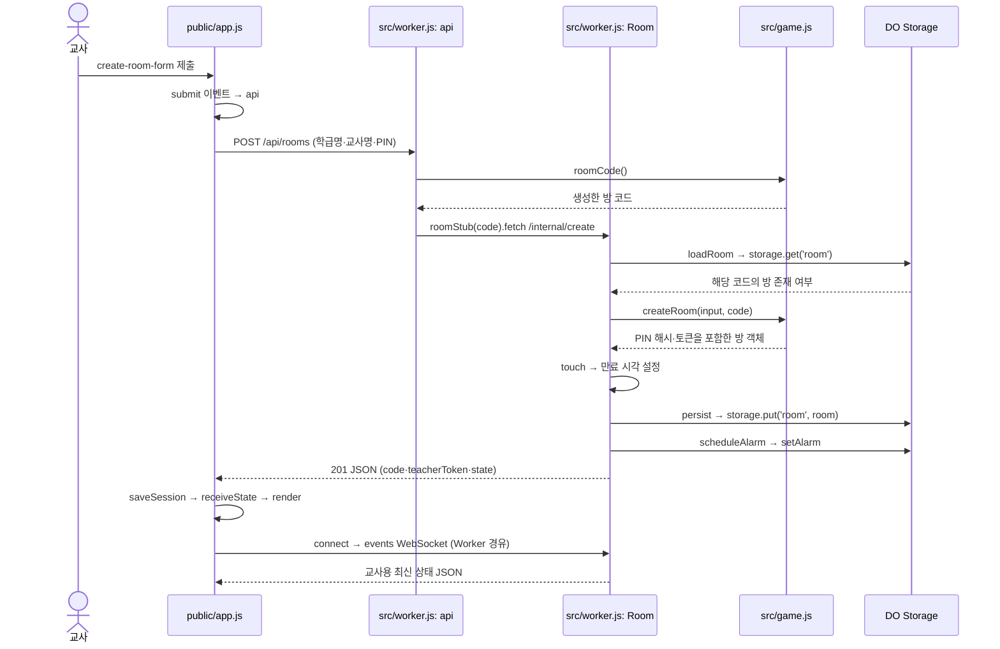
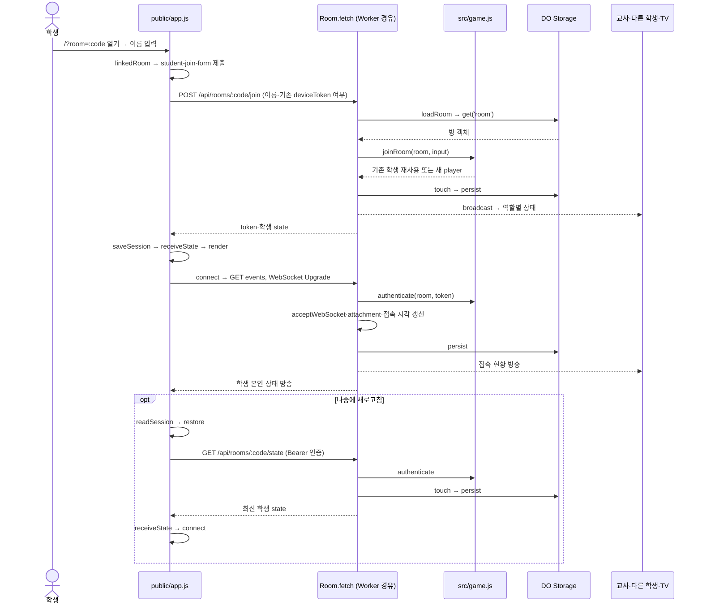
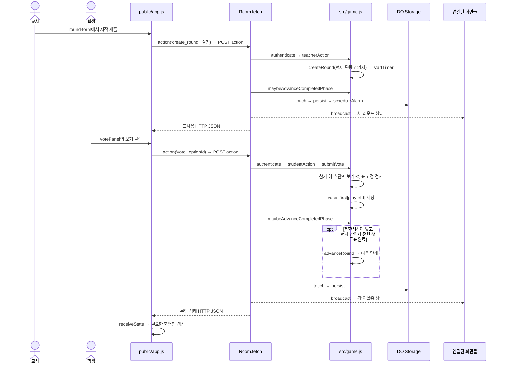
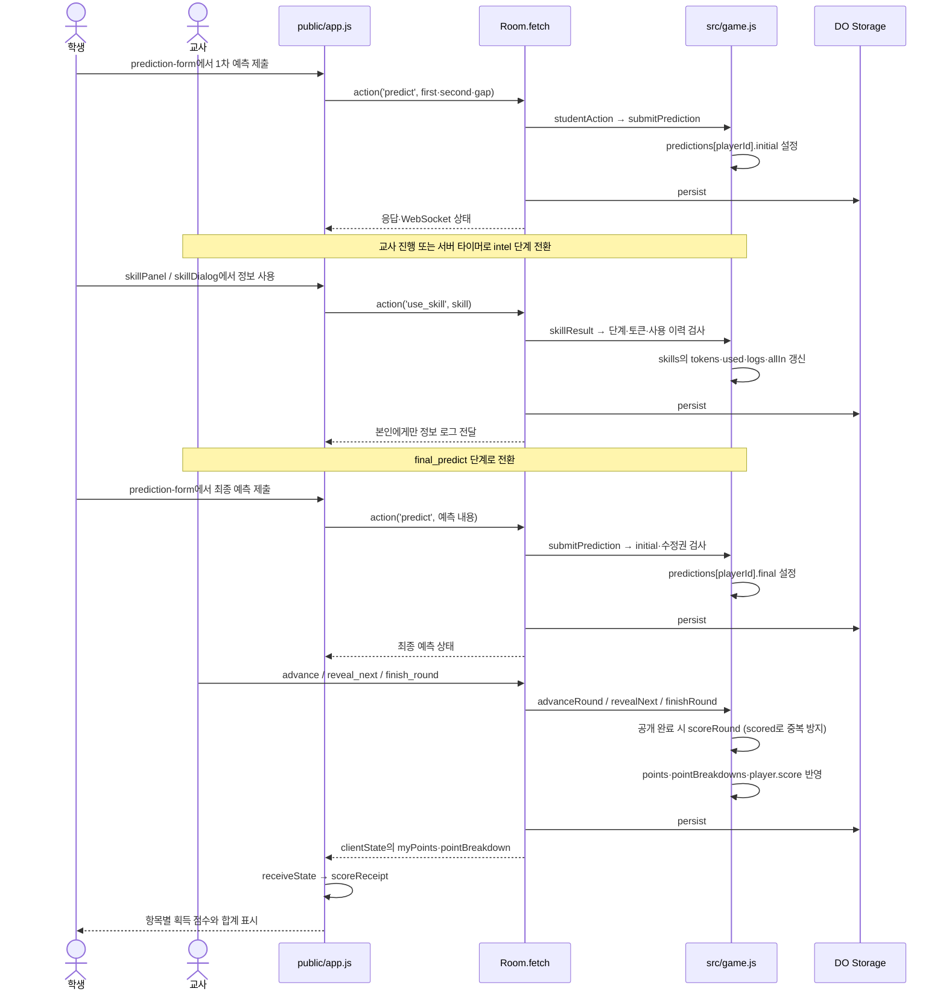
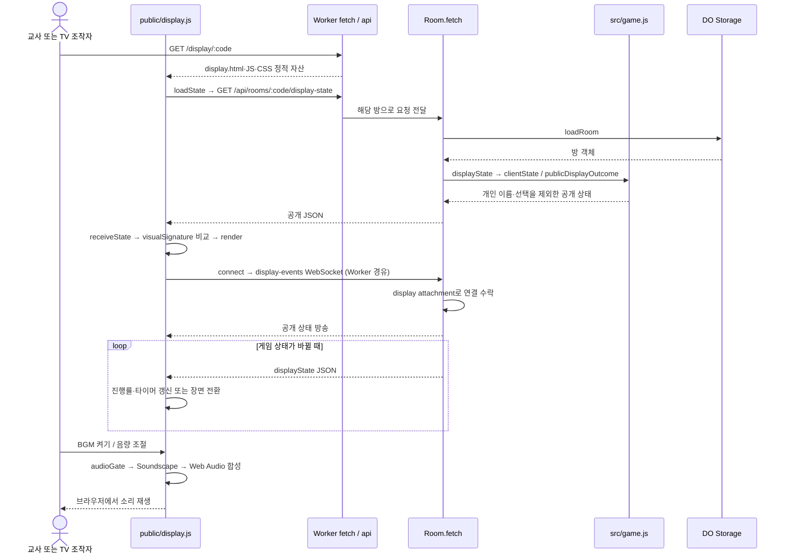

# 버튼에서 저장소까지: 실제 실행 흐름

[문서 첫 화면](README.md) · 기준일 2026-08-31

## 1. 먼저 알아둘 공통 규칙

- 화면에서 버튼을 눌렀다고 서버 데이터가 바로 바뀌는 것은 아닙니다. 브라우저가 요청하고, 서버가 권한·단계를 검사하고, 저장한 뒤 응답합니다.
- 교사·학생의 게임 명령은 `public/app.js`의 `action → api`를 거칩니다. 서버에서는 `src/worker.js`의 `api → Room.fetch`가 받고 `src/game.js`가 규칙을 적용합니다.
- 상태 변경 뒤에는 HTTP 응답과 WebSocket 방송 양쪽에서 최신 상태를 받을 수 있습니다. 이것은 같은 투표를 두 번 저장하는 구조와는 다릅니다.
- 아래의 `:code`는 방 코드 자리표시자입니다. 인증정보는 종류만 표시하며 실제 값을 싣지 않습니다.

## 2. 대표 흐름 ① 교사가 학급방을 만든다

1. HTML에 고정된 관리 화면이 있는 것이 아니라 `authScreen()`이 만든 폼을 `document`의 `submit` 이벤트가 받습니다.
2. Worker는 후보 방 코드를 만들어 같은 이름의 Durable Object를 찾습니다. 기존 방과 충돌하면 다른 코드를 시도합니다.
3. `createRoom()`은 서버 원본 객체를 만들고, 응답은 필요한 필드만 담습니다. 평문 PIN을 방 객체에 저장하지 않고 salt와 해시를 저장합니다.
4. `saveSession()`은 이 브라우저가 다시 관리 화면을 열 수 있도록 세션을 localStorage에 남깁니다.
5. 기존 방 로그인은 별도 `teacher-login-form`에서 `POST /api/rooms/:code/teacher-login`을 보냅니다. PIN 검증 성공 시 **교사 토큰을 새로 발급**하므로 이전 교사 토큰은 더 이상 유효하지 않습니다.

근거: `public/app.js`의 `authScreen`, 제출 이벤트; `src/worker.js`의 `api`, `Room.fetch`; `src/game.js`의 `createRoom`, `roomCode`, `pinHash`.

## 3. 대표 흐름 ② 학생이 초대 링크로 들어오고 재접속한다

`deviceToken`은 별도 하드웨어 식별자가 아니라 이전에 발급받은 학생 세션 토큰을 재입장 요청에서 부르는 이름입니다. 같은 토큰을 제시하면 기존 학생을 찾지만, 토큰이 없으면 이름이 같아도 새 학생으로 등록될 수 있습니다.

연결과 명단은 분리되어 있습니다.

| 상황 | 서버 처리 | 화면·집계 영향 |
|---|---|---|
| 학생의 마지막 소켓 종료 | `handleSocketDeparture`가 `lastSeen/disconnectedAt` 저장 | online 표시가 꺼지지만 등록된 학생 자체는 남음 |
| 연결 종료 후 유예 기간 안 | `activePlayerIds`가 30초간 참여 상태 유지 | 잠깐 끊긴 학생 때문에 즉시 라운드 인원이 바뀌지 않음 |
| 유예가 지난 뒤 | 알람·상태 계산에서 현재 활동 인원 제외 | 완료 대기 인원에서 빠짐. 기존 표·점수의 삭제와는 다른 처리 |
| 기존 토큰으로 복귀 | 연결 수락 때 `disconnectedAt = null` | 같은 학생으로 다시 연결; 현재 라운드 참가자였으면 복귀 가능 |
| 라운드 시작 후 새로 등록 | 참가자 스냅샷에 없음 | 이번 라운드는 관전, 다음 라운드부터 참여 |
| 교사가 X로 삭제 | `remove_player`가 `room.players`에서 삭제 | 재연결 유예가 아니라 명단 삭제. 기존 표 처리 정책은 [위험요소](findings.md) 참고 |

`restore()`는 현재 네트워크 오류도 인증 실패처럼 세션을 지우는 경로가 있습니다. 위 정상 흐름이 모든 장애 상황을 복구한다는 뜻은 아닙니다.

## 4. 대표 흐름 ③ 라운드를 시작하고 학생이 투표한다

### 타이머 표시와 자동 진행은 다른 코드다

| 역할 | 실제 코드 | 하는 일 |
|---|---|---|
| 서버 마감 시각 | `game.js`: `startTimer` | 절대 시각 `timerEnd`를 만듦 |
| 화면의 초 표시 | `app.js`: `updateTimer` / `display.js`: 타이머 갱신 | 서버 시간 차이 보정 후 남은 시간을 로컬 계산 |
| 제출 완료에 따른 조기 진행 | `maybeAdvanceCompletedPhase` | 변경이 잠긴 제출을 전원이 마쳤는지 검사 |
| 시간 만료 처리 | `worker.js`: `scheduleAlarm → alarm` | `autoAdvance`면 다음 단계, 아니면 `timerExpired` 표시 |

- 교사·학생 화면의 시간은 500ms, TV는 250ms 간격으로 다시 계산합니다. **이 간격으로 서버 상태를 fetch하는 것이 아닙니다.**
- WebSocket의 `ping/pong`은 연결 유지를 위한 메시지입니다. `pong`을 받았다고 전체 상태를 다시 그리지 않습니다.
- 조기 진행 대상은 현재 `vote`와 변경권이 남지 않은 전원의 `final_predict`입니다. 제한시간이 없는 단계는 이 함수의 대상이 아닙니다.
- `predict`, `revote`, `team_guess`처럼 추가 수정이 가능한 단계는 전원 제출만으로 조기 종료하지 않습니다. 최종 예측에도 세컨드 찬스가 남아 있으면 기다립니다.
- `autoAdvance`를 끄면 시간 만료 자체가 단계 전환을 강제하지 않습니다. 화면 시간이 0이 됐다는 사실과 서버의 제출 가능 단계가 끝났다는 사실을 구분해야 합니다.

## 5. 대표 흐름 ④ 표심전에서 예측하고 점수 내역을 받는다

서버는 최종 예측이 없으면 기존 1차 예측을 채점에 사용할 수 있습니다. 다만 1차 예측 자체를 건너뛴 학생이 최종 단계에서 처음 제출하는 경우는 현재 거절됩니다. 예측 미제출 시 토큰 점수까지 어떻게 처리되는지도 `scoreRound`가 정하며, 단순히 화면의 점수 안내만 바꿔서는 규칙이 바뀌지 않습니다.

`scoreRound()`의 `scored`는 같은 라운드 점수의 중복 가산을 막는 플래그입니다. 이것이 모든 API의 중복 요청을 막는 범용 장치는 아닙니다.

## 6. 대표 흐름 ⑤ TV를 열어 공개 진행과 BGM을 본다

TV는 별도의 읽기 전용 클라이언트입니다. `display-state`와 `display-events`는 방 코드만 있으면 조회할 수 있으며, TV를 켠다고 학생 한 명으로 등록되지 않습니다. BGM은 외부 음원 API나 파일 다운로드가 아니라 `OscillatorNode`, gain, compressor 등을 이용한 브라우저 합성입니다. 소리는 사용자 조작으로 오디오를 허용한 뒤 재생합니다.

## 7. 전체 공개 API 지도

| 메서드·경로 | 인증 | 처리와 반환 |
|---|---|---|
| `POST /api/rooms` | 기존 세션 불필요 | 새 방·교사 세션 발급, 201 |
| `POST /api/rooms/:code/teacher-login` | 방 PIN 검사 | 교사 토큰 회전과 상태 |
| `POST /api/rooms/:code/join` | 새 학생은 이름; 기존 학생은 deviceToken 검사 | 학생 등록/재사용, 토큰과 상태 |
| `GET /api/rooms/:code/state` | Bearer 토큰, 서버는 query 토큰도 지원 | 역할별 상태; 방 활동 시각 갱신 |
| `POST /api/rooms/:code/action` | Bearer 토큰, 역할별 명령 분리 | 게임 변경·저장·방송 뒤 상태 |
| `GET /api/rooms/:code/events` | WebSocket query 토큰 | 교사·학생 실시간 연결 |
| `GET /api/rooms/:code/display-state` | 토큰 없음 | TV 공개 상태 |
| `GET /api/rooms/:code/display-events` | 토큰 없음; WebSocket Upgrade 필요 | TV 공개 실시간 연결 |

`/internal/create`는 공개 학생용 API가 아닙니다. Worker가 `ROOMS` 바인딩으로 찾은 객체에 보내는 내부 요청입니다. 코드의 `https://room.internal/...`은 외부 서비스를 호출하는 주소로 해석하면 안 됩니다.

### action 안에서 다시 나뉘는 명령

| 역할 | action 이름 | `src/game.js`의 처리 |
|---|---|---|
| 교사 | `create_round` | `createRound` |
| 교사 | `advance` | `advanceRound` |
| 교사 | `reveal_next` | `revealNext` |
| 교사 | `finish_round` | `finishRound` |
| 교사 | `set_timer` | 설정 갱신 + `startTimer` |
| 교사 | `remove_player` | `room.players` 항목 삭제 |
| 교사 | `set_team` | 학생의 team 변경; 현재 UI 호출 없음 |
| 교사 | `reset_scores` | 등록 학생의 누적 점수 초기화 |
| 학생 | `vote` | `submitVote` |
| 학생 | `predict` | `submitPrediction` |
| 학생 | `movement_predict` | `submitMovementPrediction` |
| 학생 | `use_skill` | `skillResult` |
| 학생 | `team_guess` | `submitTeamGuess` |

## 8. 모드별 단계 지도

한 라운드의 `mode`가 아래 목록을 선택합니다. `phaseIndex`는 그 목록에서 현재 위치입니다.

| 모드 | `MODE_PHASES`에 정의된 실제 순서 |
|---|---|
| 정식 투표 `official` | `vote → reveal → finished` |
| 결과 쇼 `show` | `vote → reveal → finished` |
| 표심전 `prediction` | `vote → predict → intel → final_predict → reveal → finished` |
| 표심 이동전 `migration` | `vote → signal → revote → reveal → finished` |
| 소수파 생존 `minority` | `vote → signal → revote → reveal → finished` |
| 정확히 N명 `exact` | `vote → signal → revote → reveal → finished` |
| 정보 연합전 `alliance` | `vote → clue → team_guess → reveal → finished` |
| 비밀 목표전 `mission` | `mission → vote → signal → revote → reveal → finished` |

단계의 원본은 서버 `src/game.js`, 학생에게 보여 주는 단계명·설명·행동 안내는 `public/app.js`의 `PHASES`, `studentActionGuide`입니다. 두 곳의 책임을 구분하되 내용은 함께 맞춰야 합니다.
