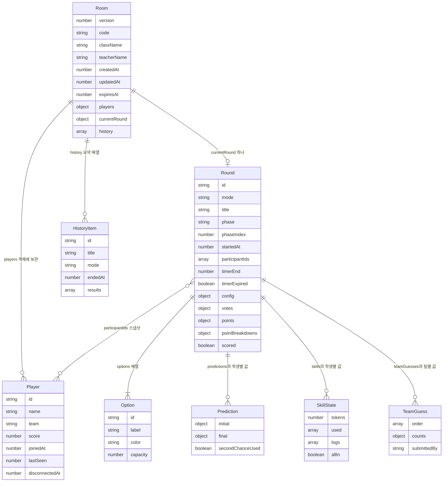

# 데이터베이스와 상태 보관 방식

[문서 첫 화면](README.md) · 기준일 2026-08-31

## 1. 결론: 방마다 하나의 객체를 영구 저장한다

이 프로젝트에는 백엔드 저장소가 있습니다. Cloudflare의 **SQLite 기반 Durable Object Storage**를 사용하지만, 앱이 SQL 테이블을 직접 만들거나 조회하지는 않습니다.

```text
방 코드
  → env.ROOMS.idFromName(code)
  → 그 방을 담당하는 Room Durable Object
  → ctx.storage
  → 키 'room' 하나에 방 객체 저장
```

| 질문 | 실제 답 | 코드 근거 |
|---|---|---|
| 어느 플랫폼인가? | Cloudflare Durable Objects | `wrangler.jsonc`: `ROOMS`, `class_name` |
| 내부 DB 엔진은? | SQLite 기반 DO 클래스 | 같은 설정의 `new_sqlite_classes` |
| 앱의 접근 방식은? | `get/put/deleteAll` 키-값 API | `src/worker.js`: `loadRoom/persist/expire` |
| 관계형인가, 문서형인가? | 기반 엔진은 관계형 SQLite, 앱의 모델은 중첩 객체를 담는 키-값 방식 | SQL 쿼리·ORM·사용자 정의 테이블 없음 |
| 테이블이나 컬렉션 이름은? | 앱이 정의한 테이블·컬렉션 없음. 실제 키는 `room` | `ROOM_KEY` |
| D1인가? Workers KV인가? | 둘 다 아님. DO Storage의 KV API를 쓰는 것 | D1/KV 바인딩 없음 |
| DB 접속 URL·비밀번호는? | 앱 코드에 없음. 플랫폼이 제공하는 바인딩으로 접근 | `env.ROOMS`, `ctx.storage` |
| 브라우저가 직접 DB를 읽는가? | 아니요. Worker → Room을 거침 | `public/app.js`: `api` / `src/worker.js` |

SQLite 기반 DO의 키-값 데이터는 플랫폼 내부 저장 구조를 사용합니다. 이를 근거로 이 앱에 `users`, `votes` 같은 SQL 테이블이 있다고 설명해서는 안 됩니다. [Cloudflare Storage 문서](https://developers.cloudflare.com/durable-objects/api/sqlite-storage-api/)

## 2. 논리적인 데이터 관계

아래 ER 도식의 상자는 **실제 객체와 하위 객체**입니다. 물리적인 SQL 테이블, 외래키 제약, 독립적인 컬렉션이 아닙니다. 이름을 짧게 붙여 관계를 이해하기 쉽게 표현했습니다.



인증 관련 필드는 그림에서 생략했습니다. 필드 이름과 쓰임은 아래에 설명하지만 실제 값은 수록하지 않습니다. `currentRound`, `timerEnd`, `capacity` 등은 상황에 따라 `null`일 수 있습니다. `disconnectedAt`은 처음 등록할 때 항상 생성되는 필드가 아니라 연결/해제 과정에서 추가됩니다. 한 라운드의 보기는 실제로 2~6개이며 ER의 일반적인 ‘여러 개’ 표기보다 서버 검증이 더 구체적입니다.

## 3. 실제 객체 내부 구조

### 방: `room`

| 필드 | 뜻 / 만드는 곳 | 공개 범위 |
|---|---|---|
| `version` | 방 객체의 형식 식별 숫자, `createRoom` | 원본에 저장; 일반 응답에 없음 |
| `code`, `className`, `teacherName` | 방 식별과 화면 제목 | 교사·학생·TV에 전달 |
| `pinSalt`, `pinHash` | 교사 PIN 검증용 salt·해시 | 서버 원본에만 보관 |
| `teacherToken` | 교사 세션 권한을 확인하는 불투명 토큰 | 생성/로그인 시 해당 교사에게 발급; 일반 상태 응답에는 없음 |
| `pinFailures`, `pinLockUntil` | PIN 오류 횟수와 일시 잠금 시각 | 로그인 처리 중 갱신; 일반 응답에 없음 |
| `createdAt`, `updatedAt`, `expiresAt` | 생성·활동·방 만료 시각 | 서버 수명 관리 |
| `players` | 학생 ID를 키로 한 학생 객체 | 원본을 그대로 보내지 않고 필요한 필드만 선별 |
| `currentRound` | 현재 라운드 하나 또는 `null` | 역할별로 가공해서 전달 |
| `history` | 종료된 라운드의 집계 요약 | 교사 응답에 일부 포함, 현재 별도 표시 화면 없음 |

### 학생: `room.players[playerId]`

| 필드 | 뜻 |
|---|---|
| `id` | 방 안에서 학생을 구분하는 ID |
| `token` | 해당 학생 세션을 검증하는 비밀 토큰. 다른 사용자 응답에 넣지 않음 |
| `name` | 학생이 입력한 이름 |
| `team` | 팀 이름. 일반 모드에도 저장되지만 UI는 정보 연합전에서 팀 표시 |
| `score` | 해당 방에서 누적한 학생 점수 |
| `joinedAt`, `lastSeen` | 최초 입장 및 재입장/연결 처리의 기록 시각 |
| `disconnectedAt` | 마지막 학생 소켓의 연결이 끊긴 시각 또는 `null` |

팀은 별도 엔티티/테이블에 저장하지 않습니다. 학생의 `team` 문자열로 묶고 `clientState()`가 점수 합계를 계산합니다. 따라서 `teamScores`는 저장된 팀 점수 장부가 아니라 학생 누적 점수에서 매번 만든 값입니다.

### 라운드: `room.currentRound`

| 묶음 | 실제 필드 | 용도 |
|---|---|---|
| 식별·단계 | `id`, `mode`, `title`, `phase`, `phaseIndex`, `startedAt` | 어떤 게임의 어느 단계인지 |
| 참가자 | `participantIds` | 라운드 시작 시 활동 학생의 ID 스냅샷. 중간 신규 입장은 관전 처리 |
| 보기 | `options[]`: `id`, `label`, `color`, `capacity` | 투표 대상. capacity는 정확히 N명 모드에서 사용 |
| 시간 | `timerEnd`, `timerExpired` | 서버 마감 시각과 시간 만료 여부 |
| 설정 | `config.timerSeconds`, `autoAdvance`, `anonymous`, `resultPrivacy`, `revealStyle`, `minorityMinimum`, `roles`, `falseClue` | 진행·공개·역할·단서 정책. `anonymous`는 현재 동작 분기에서 사용되지 않음 |
| 표 | `votes.first[playerId]`, `votes.final[playerId]` | 첫 표와 최종 표에 선택지 ID 저장 |
| 최종 선택 확인 | `confirmations[playerId]` | 최종 선택 단계 제출 완료 표시 |
| 예측 | `predictions[playerId]` | 1차·최종 예측과 수정권 사용 기록 |
| 이동 예측 | `movementPredictions[playerId]` | 이동 인원 구간·1위 변화·표 차이 추세 |
| 정보 | `skills[playerId]`, `clues[playerId]` | 개인 토큰·사용 이력·정보 로그·단서 문장 |
| 팀 제출 | `teamGuesses[team]` | 팀 공동 순위·득표수 추리, 마지막 제출자 이름 |
| 개인 목표 | `missions[playerId]`, `roles[playerId]` | 비밀 임무 객체와 역할 식별 문자열 |
| 중간 공개 | `signal` | 선택지 ID별 `혼잡`, `한산`, `보통` 문구를 담은 중간 신호 |
| 공개 연출 | `reveal.step`, `totalSteps`, `order`, `tallyOrder` | 단계별 결과 공개 순서와 진행량 |
| 채점 | `points[playerId]`, `pointBreakdowns[playerId]`, `scored` | 이번 점수·항목별 내역·중복 채점 방지 |

`predictions`의 `initial/final`에는 각각 `first`, `second`, `gap`, `split`이 들어갑니다. `movementPredictions`에는 `switchRange`, `winnerChange`, `gapTrend`가 들어갑니다. `skills.logs[]`는 `skill`, `text`, `pointBreakdowns[]`는 `label`, `points` 형태입니다. `missions`에는 `type`, `optionId`, `target`이 들어갑니다. 모두 `src/game.js`에서 확인한 필드입니다.

## 4. 생성·읽기·수정·삭제 위치

| 작업 | 게임 객체를 다루는 코드 | 실제 영구 저장 호출 |
|---|---|---|
| 방 생성 | `createRoom` | `Room.fetch('/internal/create') → persist → storage.put` |
| 방 읽기 | `Room.loadRoom` | `storage.get(ROOM_KEY)` |
| 학생 생성·복귀 | `joinRoom` | join 처리 뒤 `touch → persist` |
| 투표·예측·정보·팀 답 | `studentAction`과 하위 함수 | action 처리 뒤 `touch → persist` |
| 단계·설정·점수 변경 | `teacherAction`, `advanceRound`, `scoreRound` | action 뒤 persist; 알람 변경은 `storage.put` |
| 연결 상태 기록 | 연결 수락, `handleSocketDeparture` | `persist` |
| 학생 삭제 | `teacherAction('remove_player')` | players에서 삭제한 방 객체를 persist |
| 점수 초기화 | `teacherAction('reset_scores')` | 학생 누적 점수를 바꾼 객체를 persist |
| 방 만료 | `Room.loadRoom`, `Room.alarm → expire` | 소켓 종료 후 `storage.deleteAll()` |

`game.js` 함수가 객체를 바꾸는 것과 DB에 저장되는 것은 분리되어 있습니다. 게임 엔진만 메모리에서 실행하는 단위 테스트에서는 Cloudflare 저장소에 쓰지 않습니다.

## 5. 서버 원본과 화면 응답은 다르다

`clientState()`와 `displayState()`는 원본 데이터를 역할에 맞게 가공합니다. 이 응답을 DTO, 즉 ‘전달용 데이터 형태’라고 부를 수 있습니다.

| 응답 필드 | 어디에서 계산하는가 | 원본과의 차이 |
|---|---|---|
| `serverTime` | 응답 생성 시 `Date.now()` | 저장된 게임 필드 아님 |
| `online` | 현재 소켓의 토큰 목록 | 저장된 boolean을 읽는 것이 아님 |
| `roundActive`, `totalPlayers`, `totalTeams` | 참가자 스냅샷 + 현재 연결/유예 | 등록된 학생 수와 다를 수 있음 |
| `submissions` | 활동 참가자의 제출 여부 | 방 전체 제출 객체의 단순 길이와 다름 |
| `results` | `publicResults` | 공개 방식·진행 단계·역할에 따라 필터 |
| `myVote`, `prediction`, `skillState`, `mission` | 현재 학생 ID로 조회 | 다른 학생의 비밀 선택/정보는 전달하지 않음 |
| `myPoints`, `pointBreakdown` | 채점 완료 후 본인 항목 | 점수 내역을 개인 화면에 제공 |
| `teamScores` | 모든 등록 학생의 누적 점수 합산 | 팀 모드가 아닌 때에도 API 응답에는 존재 |
| TV의 `players` | 이름·ID 등을 제거한 `{ online }` 목록 | TV에 학생 명단을 그대로 전달하지 않음 |

DB 권한은 Firestore Rules 같은 별도 파일이 아니라 `authenticate`, 교사/학생 명령 분리, 단계 검증, 응답 필터에서 구현됩니다. 화면에서 버튼을 숨기는 것만으로 권한을 제한하는 구조는 아닙니다.

## 6. 데이터가 언제까지 남는가?

- 방 전체의 만료 기준은 `ROOM_TTL_HOURS`를 읽는 `Room.ttlMs()`가 정합니다. 이 문서에는 설정값을 싣지 않습니다.
- 방 생성·로그인·입장·인증 상태 조회·action·WebSocket 연결 수락에서 `touch()`로 활동 및 만료 시각을 갱신합니다.
- 이미 열린 소켓의 `ping/pong`과 공개 TV 상태 조회만으로 `touch()`가 호출되는 것은 아닙니다. ‘TV가 켜져 있음’과 ‘방 만료가 계속 연장됨’을 동일하게 보면 안 됩니다.
- `expire()`는 해당 방 DO의 저장 데이터를 지웁니다. 별도의 영구 학생 계정, 장기 성적표, 백업 내보내기 기능은 현재 코드에서 확인되지 않았습니다.
- 새 라운드는 `currentRound`를 교체합니다. 개인 표·예측·토큰 사용·점수 세부 내역 전체가 여러 라운드 이력으로 보관되는 구조는 아닙니다.
- `finishRound()`는 집계 결과 요약을 `history`에 최대 20개 보관합니다. 교사 응답에는 최근 5개만 포함되고 현재 기록 UI는 연결되어 있지 않습니다.
- `advanceRound()`로 `finished`에 도달하는 경로는 `finishRound()`와 같지 않아 기록 생성이 다릅니다. 장기 보관이나 감사 기록이 필요하면 별도 정책이 필요합니다.

## 7. 브라우저와 로컬 개발 환경의 저장소

| 저장 위치 | 보관 내용 | 브라우저를 닫거나 새로고침하면? |
|---|---|---|
| 교사·학생 localStorage | 방 코드·역할·세션 토큰, 학생 이름 | 일반적으로 남음. 나가기/저장소 삭제/현재 복원 실패 처리로 지워질 수 있음 |
| TV localStorage | BGM 음량, 방 코드 숨김 설정 | 같은 브라우저에 남음 |
| `app.js`의 `state` | 서버가 보낸 최신 상태 | 메모리이므로 페이지 재시작 때 다시 조회 |
| `formDrafts` Map, `draftOptions` | 미제출 폼·보기·선택 초안 | 같은 페이지의 재렌더링에는 복구하지만 새로고침 복구 보장은 없음 |
| `sw.js`의 Cache API | 일부 HTML·CSS·JS·이미지 | 캐시가 남아도 오프라인 투표를 저장·전송하는 기능은 없음 |
| `.wrangler/state/` | Wrangler 로컬 개발용 상태 | 운영 Cloudflare 저장소와 별개. 실제 방 데이터 내용은 조사하지 않음 |

`sessionStorage`, IndexedDB, 운영용 `data/rooms.json` 저장 코드는 없습니다. `.wrangler` 안에 SQLite 관련 파일이 있다는 사실을 ‘운영 서버가 내 PC의 DB 파일을 쓴다’고 해석하면 안 됩니다.

## 8. 입문자가 자주 묻는 질문

**서버와 DB는 같은 것인가?** 아니요. Room의 코드는 요청을 검사·계산하고, Storage는 데이터를 보관합니다. 같은 Cloudflare 플랫폼 안에 있어도 역할은 다릅니다.

**브라우저를 닫으면 표도 없어지는가?** 이미 서버에 저장된 표는 브라우저 종료만으로 사라지지 않습니다. 다만 방 만료·새 라운드 교체·삭제 정책에 따른 수명은 있습니다. 아직 제출하지 않은 입력은 별개입니다.

**여러 사람이 동시에 같은 결과를 볼 수 있는가?** 같은 방 DO가 저장한 상태를 각 연결에 WebSocket으로 전달하므로 가능합니다. 권한에 따라 전달하는 상세 정보는 다릅니다.

**별도의 Firebase/Supabase 설정이 필요한가?** 현재 구조에는 없습니다. 이 프로젝트의 저장소와 실시간 연결은 Cloudflare DO가 담당합니다.

**localStorage에 토큰이 있으니 DB 키도 브라우저에 넣어도 되는가?** 아닙니다. 학생/교사 세션 토큰과 플랫폼 관리자 비밀키는 권한 범위가 다릅니다. Cloudflare 배포 인증정보를 프론트엔드에 넣어서는 안 됩니다.
