# 로컬 코드가 실제 서비스가 되는 과정

[문서 첫 화면](README.md) · 기준일 2026-08-31

## 1. 확인된 배포 구조

**Cloudflare Worker 하나의 배포에 서버 코드와 정적 화면 파일을 함께 올립니다.** 별도의 Vercel 프론트엔드, Render 서버, Firebase DB를 조합한 구조가 아닙니다.

```mermaid
flowchart LR
  PC["개발자 PC<br/>public · manual · src"]
  Build["npm run build<br/>Node.js 복사 스크립트"]
  Dist[".dist<br/>배포할 HTML·CSS·JS·이미지"]
  Config["wrangler.jsonc<br/>Worker·Assets·ROOMS 연결"]
  CLI["Wrangler<br/>Worker 번들·자산 배포"]
  Worker["Cloudflare Workers<br/>HTTP 입구·Room 클래스"]
  Assets["Workers Static Assets<br/>정적 파일·CDN"]
  Store[("DO Storage<br/>배포 파일과 별개인 방 데이터")]
  User["교사·학생·TV<br/>서비스 URL을 여는 브라우저"]
  Git["GitHub / Workers Builds<br/>README에 설정 안내 존재<br/>현재 연결 상태 확인 필요"]
  PC -->|public·manual 원본| Build
  Build -->|선택한 파일 복사| Dist
  Dist -->|정적 자산| CLI
  PC -->|src 서버 코드| CLI
  Config -->|배포 설정·바인딩| CLI
  CLI -->|컴파일·업로드| Worker
  CLI -->|정적 자산 업로드| Assets
  Worker <-->|방 객체 get / put| Store
  Assets -->|HTTPS HTML·CSS·JS·이미지| User
  User <-->|HTTPS API / WSS 상태| Worker
  classDef front fill:#e7f1ff,stroke:#3971b8,color:#15385c;
  classDef back fill:#e7f4e9,stroke:#39844d,color:#194c2a;
  classDef store fill:#fff0da,stroke:#bd7823,color:#704511;
  classDef ops fill:#eef0f3,stroke:#777f8c,color:#303943;
  class User front;
  class Worker back;
  class Store store;
  class PC,Build,Dist,Config,CLI,Assets,Git ops;
```

GitHub 상자는 현재 확인된 전달 경로와 연결하지 않았습니다. README의 자동 배포 설명과 실제 계정의 활성화 상태를 구분하기 위해서입니다.

## 2. 명령어와 실제 실행 내용

아래는 **프로젝트 루트에서 사용하는 안내 명령**입니다. 이번 문서화 작업에서는 테스트와 읽기 전용 검사만 실행했으며, 빌드·로그인·배포를 새로 실행하지 않았습니다.

| 목적 | 명령 | 실제 내용 / 주의점 |
|---|---|---|
| 의존성 설치 | `npm ci` | lock 기준 설치. `package.json`의 Node.js 요구 조건은 20 이상 |
| 로컬 개발 | `npm run dev` | 먼저 build, 이어서 `wrangler dev` |
| start 별칭 | `npm start` | `npm run dev`와 같음. 별도 운영 Node 서버를 시작하는 명령이 아님 |
| 정적 배포 폴더 생성 | `npm run build` | `node scripts/build-assets.js` |
| 테스트 | `npm test` | Node 내장 `node --test` |
| 배포 계정 로그인 | `npx wrangler login` | 기존 README의 Cloudflare CLI 인증 방법. 앱 교사 로그인과 별개 |
| 운영 배포 | `npm run deploy` | build 뒤 `wrangler deploy`. 실제 클라우드 상태를 변경하므로 의도한 배포 때만 실행 |
| 업로드 전 점검 | `npx wrangler deploy --dry-run` | README에 안내된 점검. 자산 build가 먼저 필요하며 실제 배포와 구분 |

로컬 안내 주소는 [http://127.0.0.1:8787](http://127.0.0.1:8787)입니다. 포트 충돌이나 실행 옵션이 있으면 Wrangler가 실제로 출력한 주소를 확인해야 합니다.

## 3. build는 무엇을 하는가?

`scripts/build-assets.js`의 실제 동작은 다음과 같습니다.

1. 프로젝트 루트 아래의 `.dist` 경로인지 확인합니다.
2. 기존 `.dist` 출력 폴더를 비웁니다.
3. `public/` 전체를 `.dist/`로 복사합니다.
4. `manual/index.html`과 `manual/assets/`만 `.dist/manual/`로 복사합니다.

프론트엔드를 React/Vite로 컴파일하거나 CSS를 압축하는 스크립트는 아닙니다. Worker 서버 코드의 번들 처리는 Wrangler가 담당합니다.

| 원본 | 배포 결과 | 배포 여부 |
|---|---|---|
| `public/index.html`, JS·CSS·manifest·SW·이미지 | `.dist/`의 같은 경로 | 포함 |
| `manual/index.html` | `.dist/manual/index.html` | 포함 |
| `manual/assets/` | `.dist/manual/assets/` | 포함 |
| `src/worker.js`, `src/game.js` | Worker 서버 코드 | 정적 폴더 복사와 별도로 Wrangler가 배포 |
| `manual/qa`, `manual/sources`, 제작 기록 | 없음 | 제외 |
| `260822_game_mode_guide/` | 없음 | 제외 |
| `docs/architecture/` | 없음 | 제외 |
| `test/`, `output/`, `.wrangler/` | 없음 | 제외 |

따라서 `.dist/app.js`를 직접 수정하는 것은 지속적인 수정 방법이 아닙니다. 다음 build에서 원본으로 덮어씁니다. `npm run dev`의 복사 단계도 시작 시 한 번 실행되므로 `public/` 변경이 화면에 보이지 않으면 원본과 `.dist`의 차이부터 확인하세요. 이 복사 스크립트 자체에는 지속 감시 기능이 없습니다.

## 4. Wrangler 설정을 읽는 순서

| 설정 키 | 역할 | 확인할 점 |
|---|---|---|
| `name` | Worker 서비스 이름 | 기본 서비스 주소 구성에 관계. 변경을 단순한 화면 제목 변경으로 보지 말 것 |
| `main` | 서버 실행 진입 파일 | 현재 `src/worker.js` |
| `compatibility_date` | 적용할 플랫폼 호환성 기준 | 게임의 날짜나 데이터 만료일이 아님 |
| `assets.directory` | 정적 자산 폴더 | `.dist`를 제공하므로 build 결과 필요 |
| `assets.binding` | 서버에서 정적 파일을 찾는 이름 | `ASSETS`와 코드가 맞아야 함 |
| `assets.html_handling` | HTML 경로 처리 정책 | 현재 Worker의 명시적 URL 처리와 함께 확인 |
| `assets.run_worker_first` | 먼저 Worker로 보낼 경로 | `/api/*`, 첫 화면, TV, 설명서 경로 |
| `durable_objects.bindings` | 방 서버 연결 | `ROOMS` ↔ `Room` 클래스 |
| `migrations` / `new_sqlite_classes` | SQLite 기반 DO 클래스 등록 | 앱 SQL 테이블 생성 문법이 아님 |
| `vars` | 서버 설정 | 사용 변수 이름·용도는 [환경변수 지도](external-services.md), 실제 값은 이 문서에 없음 |
| `observability` | 플랫폼 관측 기능 | 활성 설정은 확인했으나 계정 보존 기간·대시보드 내용은 미조사 |

## 5. GitHub에 push하면 자동 배포되는가?

**현재 폴더 조사만으로는 확인할 수 없습니다.**

확인된 사실:

- 루트 README는 GitHub `kimmokdong/poll`의 `main` 브랜치를 Workers Builds에 연결하는 방식을 적고 있습니다.
- README의 빌드/배포 안내는 `npm run build`, `npx wrangler deploy`입니다.
- 현재 로컬 폴더에는 `.git`이 없고 Git 작업 트리로 인식되지 않습니다. `.github/workflows`도 없습니다.
- Cloudflare 대시보드의 Build 연결, 원격 저장소, 최근 커밋·빌드 로그는 이번 범위에서 확인하지 않았습니다.

`.github/workflows`가 없다고 자동 배포가 반드시 없다는 뜻은 아닙니다. Workers Builds는 플랫폼 쪽 Git 연결로 동작할 수 있습니다. 연결된 경우에만 지정 브랜치 변경이 자동 빌드·배포로 이어집니다. [Cloudflare Workers Builds 문서](https://developers.cloudflare.com/workers/ci-cd/builds/)

추가 확인 순서는 Cloudflare의 해당 Worker → Settings/Builds 연결 → 저장소·브랜치·빌드 명령 → 최근 배포 로그입니다. 이 문서 작성 중에는 연결을 만들거나 설정을 바꾸지 않았습니다.

## 6. 서버는 어디서, 언제 실행되는가?

| 질문 | 이 프로젝트의 답 |
|---|---|
| 교사·학생·TV 화면은 어디서 실행? | 사용자의 브라우저에서 JS·DOM·Web Audio 실행 |
| 게임 규칙은 어디서 실행? | Cloudflare Worker/Room에서 `game.js` 실행 |
| 개발자 PC가 켜져 있어야 운영 가능한가? | 배포된 서비스는 개발자 PC를 운영 서버로 쓰지 않음 |
| 전통적인 상시 Node 프로세스인가? | 아니요. 운영 코드에 `server.listen`이 아니라 Worker 이벤트 핸들러가 있음 |
| 서버리스인가? | HTTP·WebSocket·알람 이벤트로 실행되는 플랫폼 관리 코드 |
| 완전히 정적인 웹사이트인가? | 아니요. 화면 자산은 정적이지만 투표·저장·실시간 연결에는 백엔드가 필요 |
| CDN을 쓰는가? | Static Assets가 정적 파일을 배포·캐시. API JSON과 역할이 다름 |
| DB도 `.dist`와 함께 복사되는가? | 아니요. DO의 저장 데이터는 배포 정적 파일과 별개 |

Workers Static Assets는 정적 파일의 배포·캐시를 담당합니다. [Cloudflare Static Assets 문서](https://developers.cloudflare.com/workers/static-assets/)

### ‘서버 슬립’과 WebSocket 휴면

이 프로젝트는 `ctx.acceptWebSocket()`과 attachment를 사용하는 DO Hibernation API 경로를 택했습니다. 플랫폼은 연결을 유지하면서 객체를 휴면시킬 수 있고, 필요할 때 다시 실행합니다. 따라서 메모리만 믿는 대신 `storage.get('room')`으로 상태를 읽는 구조가 중요합니다. [Cloudflare WebSocket 휴면 문서](https://developers.cloudflare.com/durable-objects/best-practices/websockets/)

이는 특정 무료 서버 호스팅의 ‘오랫동안 요청이 없으면 앱 전체가 잠든다’는 설명을 그대로 적용할 상황이 아닙니다. 실제 계정 요금제, 사용량 제한, 활성 객체의 휴면 여부, 학교 네트워크의 WebSocket 제한은 **확인 필요**입니다. 끊김 원인을 무조건 무료 요금제 슬립이라고 단정할 근거는 없습니다.

## 7. 서비스 주소와 읽기 전용 확인 결과

현재 확인한 운영 주소는 [마음신호](https://maeum-signal-poll.maeum-signal-vote-game.workers.dev)입니다. `workers.dev` 주소는 Cloudflare 계정의 하위 도메인과 Worker 서비스 이름으로 제공되는 운영 주소이며, 정적 폴더 이름이 곧 서비스 주소가 되는 것은 아닙니다.

2026-08-31에 아래 **공개 정적 응답만** 조회했습니다.

| 운영 경로 | 결과 | 비교한 로컬 원본 |
|---|---|---|
| `/` | HTTP 200, 내용 일치 | `public/index.html` |
| `/app.js` | HTTP 200, 내용 일치 | `public/app.js` |
| `/display.js` | HTTP 200, 내용 일치 | `public/display.js` |
| `/sw.js` | HTTP 200, 내용 일치 | `public/sw.js` |
| `/manual/` | HTTP 200, 내용 일치 | `manual/index.html` |

이 검사는 모든 자산, 서버 번들 버전, DB 상태, 자동 배포 설정이 같음을 증명하지 않습니다. 실제 교실방의 API를 열거나 데이터를 바꾸지 않았습니다. 현재 서버 배포 메타데이터, 커스텀 도메인, 별도 스테이징 환경은 **확인 필요**입니다.

## 8. 로컬과 운영이 달라지는 지점

- 로컬 방 상태는 `.wrangler/`, 운영 방 상태는 Cloudflare DO에 있습니다. 로컬에서 테스트한 학생이 운영 명단에 들어가는 구조가 아닙니다.
- 로컬 HTTP에서는 `ws:`, 운영 HTTPS에서는 `wss:`로 연결합니다. 주소는 프론트의 `location`에서 만듭니다.
- 브라우저 Cache와 Service Worker가 이전 정적 파일을 보관할 수 있습니다. API는 `no-store` JSON 응답이고 Service Worker도 `/api/`를 제외합니다.
- 노트북과 교실 TV는 브라우저·음향 허용·화면 크기·네트워크 조건이 다릅니다. 같은 서버 코드라도 현장 확인이 필요합니다.
- 이 문서와 Mermaid 이미지는 현재 build 대상이 아닙니다. 운영 사용설명서에 게시하려면 별도 요청과 배포 범위 결정이 필요합니다.
