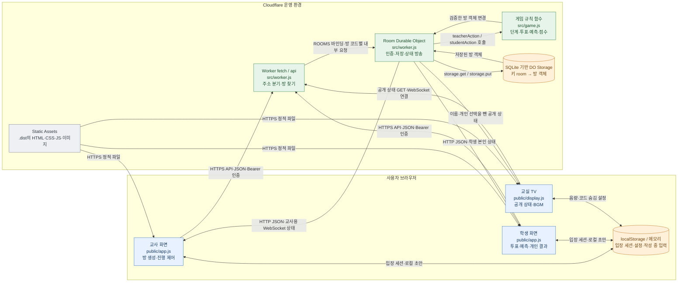
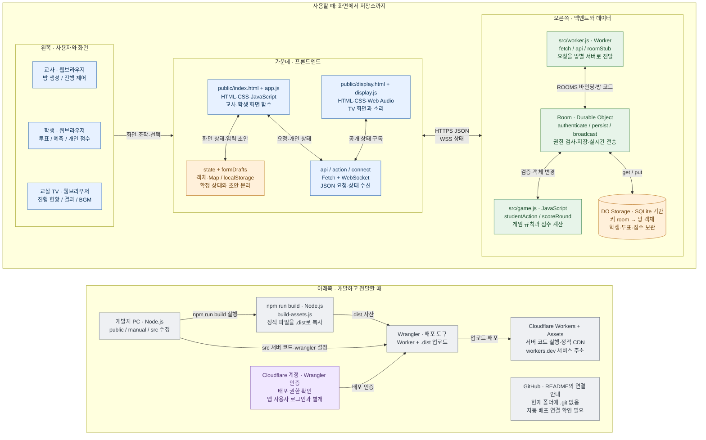

# 전체 시스템 아키텍처

[문서 첫 화면](README.md) · 기준일 2026-08-31

## 1. 실제 실행 구조

브라우저에서 보이는 화면, Cloudflare에서 실행하는 코드, 방 데이터를 보관하는 저장소는 서로 다른 역할입니다. 이 프로젝트에서는 하나의 Worker 배포가 정적 화면과 API를 함께 제공합니다.

이 그림의 저장소는 **Cloudflare D1이나 Workers KV 서비스가 아닙니다.** `wrangler.jsonc`가 `Room`을 SQLite 기반 Durable Object 클래스로 만들고, 실행 코드는 SQL 쿼리 대신 Storage의 키-값 API를 사용합니다. SQLite 기반 DO에서도 키-값 API를 사용할 수 있다는 플랫폼 설명은 [Cloudflare Storage 문서](https://developers.cloudflare.com/durable-objects/api/sqlite-storage-api/)와 일치합니다.

## 2. 구성요소의 역할

| 구성요소 | 실제 사용 기술 또는 플랫폼 | 역할 | 관련 코드 위치 | 입문자가 알아둘 개념 |
|---|---|---|---|---|
| 교사·학생 웹 입구 | HTML | JavaScript와 CSS를 불러오고 화면을 담을 요소 제공 | `public/index.html` | HTML 자체에는 전체 화면이 미리 들어 있지 않음 |
| 교사·학생 화면 | 순수 JavaScript | 역할·단계별 HTML 문자열, 폼, 버튼, 세션 처리 | `public/app.js`: `render`, `teacherView`, `studentView` | 화면 함수가 이 프로젝트의 컴포넌트 역할 |
| TV 화면 | 별도 HTML·JS·CSS | 공개 진행·결과와 음향 연출 | `public/display.*` | 같은 데이터를 다른 개인정보 범위로 표시 |
| 게임 API 입구 | Cloudflare Worker | 경로 분기, 요청 크기·JSON 검사, 방 객체 전달 | `src/worker.js`: `fetch`, `api`, `readJson` | 서버리스 HTTP 핸들러 |
| 방별 서버 | Durable Object `Room` | 인증, 방 불러오기, 저장, WebSocket, 알람 | `src/worker.js`: `Room` | 방 코드 하나가 상태를 소유하는 객체 하나를 찾음 |
| 게임 규칙 | 서버 JavaScript ES module | 모드·단계·투표·예측·승리·점수 결정 | `src/game.js` | 브라우저에서 임의로 점수를 결정하지 않음 |
| 영구 저장소 | DO 내부 SQLite 기반 Storage | 방 객체 전체를 `room` 키에 보관 | `Room.loadRoom`, `persist`, `expire` | 관계형 DB 엔진 위에서 객체를 키-값 형태로 저장 |
| 실시간 연결 | WebSocket Hibernation API | 서버에서 각 연결로 최신 상태 전송 | `acceptWebSocket`, `broadcast`, `webSocketMessage` | Socket.IO·SSE가 아니라 기본 WebSocket |
| 브라우저 로컬 저장 | localStorage·Map | 재입장용 세션, TV 설정, 미제출 초안 | `readSession`, `saveSession`, `formDrafts` | 서버 데이터의 대체 저장소가 아님 |
| 정적 캐시 | Service Worker Cache API | 네트워크 실패 시 일부 화면 자산 재사용 | `public/sw.js` | API 데이터와 오프라인 투표는 저장하지 않음 |
| 빌드·업로드 | Node.js·Wrangler | `.dist` 생성, Worker와 정적 자산 배포 | `scripts/build-assets.js`, `package.json` | 빌드는 배포 준비, 배포는 클라우드 업로드 |
| 사용설명서 | 자체 HTML·CSS·JS | 역할별 사용 흐름·이미지 확대 | `manual/index.html` | 앱 API와 독립적인 정적 교육자료 |

## 3. 화면 주소와 실제 파일

| URL 형태 | 실제 처리 | 화면이 선택되는 이유 |
|---|---|---|
| `/` | Worker가 `/index.html` 자산을 반환 | 저장 세션이 없으면 교사용 첫 화면 |
| `/?room=:code` | 동일한 `index.html` | `app.js`의 `linkedRoom`이 학생 초대 화면을 선택 |
| 교사 관리·학생 진행 화면 | 같은 `/` 안에서 `render()` | 별도 `/teacher`, `/student` 라우트 없음 |
| `/display` | `/display/`로 308 리다이렉트 | TV 입구 주소 정규화 |
| `/display/`, `/display/:code` | `/display.html` 자산 반환 | TV 스크립트가 경로 또는 query의 방 코드를 읽음 |
| `/manual` | `/manual/`로 308 리다이렉트 | 설명서 주소 정규화 |
| `/manual/` | `/manual/index.html` 자산 반환 | 정적 설명서 |
| `/api/rooms/...` | `api()` → `Room.fetch()` | 화면 파일이 아니라 JSON·WebSocket 요청 |
| 나머지 정적 주소 | `env.ASSETS.fetch(request)` | CSS·JS·PNG·manifest·Service Worker 제공 |

`wrangler.jsonc`의 `run_worker_first` 경로와 위 Worker 라우팅을 함께 읽어야 합니다. 정적 자산을 먼저 처리할 수 있는 경로까지 모두 사용자 코드의 `fetch`를 거친다고 가정하지 마세요.

## 4. 역할과 개인정보 경계

| 정보·기능 | 교사 | 학생 | 교실 TV |
|---|---|---|---|
| 학급방 만들기 | 공개 생성 API 이용 | UI는 제공하지 않음 | 없음 |
| 기존 방 관리 | 방 코드 + PIN으로 세션 발급 | 불가 | 불가 |
| 라운드 생성·다음 단계·학생 삭제 | 교사 토큰 검사 후 허용 | 교사 명령 실행 불가 | 상태 조회만 가능 |
| 이름·팀 명단 | 응답에 포함 | 응답에는 전체 명단 포함, 일반 학생 화면은 본인 중심 | 이름·ID 제거, online 상태만 포함 |
| 개별 투표·예측·임무 | 응답에 다른 학생의 비밀 내용 없음 | 본인의 내용만 포함 | 없음 |
| 개인 점수 | 개별 점수는 응답에서 숨김 | 본인 점수만 제공 | 팀 합계만 제공 |
| 결과 공개 범위 | 교사용 집계 결과 | `resultPrivacy` 적용 | `resultPrivacy` 적용 |

- `authenticate()`는 서버가 발급한 불투명 토큰을 방의 토큰과 비교합니다. JWT나 외부 로그인 SDK를 사용하지 않습니다.
- TV 공개 API에는 토큰 인증이 없습니다. 방 코드를 아는 사람은 학급명·교사명·공개 집계 등 TV용 데이터를 볼 수 있습니다. “읽기 전용”과 “비공개”는 다른 뜻입니다.
- `teamScores`는 화면에 팀을 숨기는 모드에서도 상태 응답에 들어갑니다. UI에서 숨겼다는 이유만으로 API에도 없다고 판단하면 안 됩니다.
- PIN과 토큰은 서버 원본 방 객체에는 있지만, 일반 `clientState` 응답의 방 정보에는 포함되지 않습니다. 세션 발급 응답은 해당 사용자에게 토큰을 전달합니다.

근거: `src/game.js`의 `authenticate`, `clientState`, `displayState`, `publicResults`; `src/worker.js`의 `Room.fetch`.

## 5. 누가 상태의 주인인가?

| 상태 | 주인 | 예 | 수명 |
|---|---|---|---|
| 확정된 게임 상태 | 서버의 방 객체 | 제출한 표, 현재 단계, 점수 | 저장소에 유지되다가 방 만료 시 삭제 |
| 연결 상태 | Durable Object의 WebSocket 목록 | 연결 여부, 소켓 attachment | 현재 연결에 연결됨 |
| 작성 중인 초안 | 브라우저 메모리 | 아직 제출하지 않은 제목·예측 | 새로고침하면 사라질 수 있음 |
| 재입장 정보 | 브라우저 localStorage | 방 코드·역할·세션 토큰 | 나가기·저장소 삭제·복원 실패 처리까지 |
| 표시 시간 | 브라우저 계산 | 서버 시간 차이를 보정한 남은 시간 | 화면 타이머가 주기적으로 다시 계산 |

학생 화면은 `studentVisualSignature`, TV는 `visualSignature`로 의미 있는 변경을 구분합니다. 하지만 전송 자체는 작은 변경분만 보내는 방식이 아니라 **역할별 전체 상태 JSON**입니다.

## 6. 한 장짜리 프로젝트 해부도

읽는 순서: **왼쪽 사용자 → 가운데 화면 코드 → 오른쪽 서버와 저장소**, 아래쪽은 개발·배포 과정입니다. GitHub는 README에 언급된 대상일 뿐, 연결된 배포 경로로 그리지 않았습니다.

범례: 파랑은 화면·브라우저, 초록은 서버, 주황은 데이터·저장, 보라는 외부 계정 서비스, 회색은 개발·배포입니다. 운영 앱에 업무용 외부 API나 외부 사용자 인증 서비스는 없습니다. 발표자료 HTML의 외부 글꼴은 [외부 서비스 지도](external-services.md)에서 별도로 구분합니다.

근거 파일: [app.js](../../public/app.js), [display.js](../../public/display.js), [worker.js](../../src/worker.js), [game.js](../../src/game.js), [빌드 스크립트](../../scripts/build-assets.js), [배포 설정](../../wrangler.jsonc).
